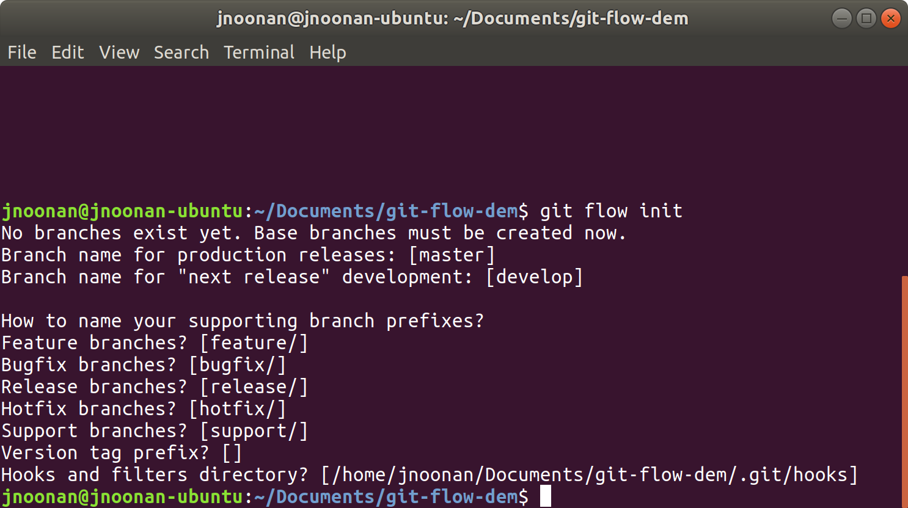
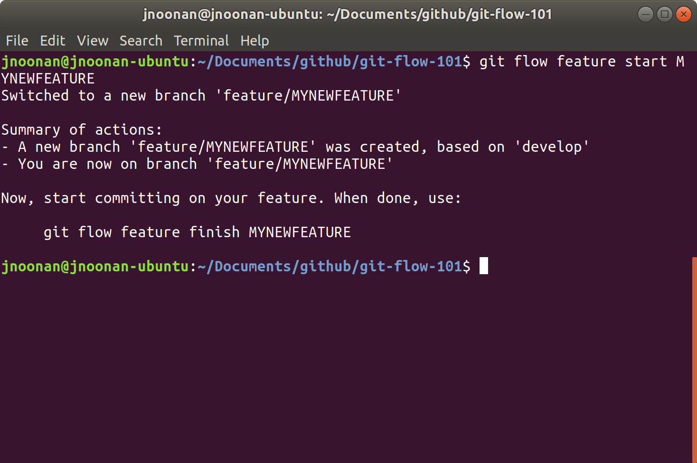
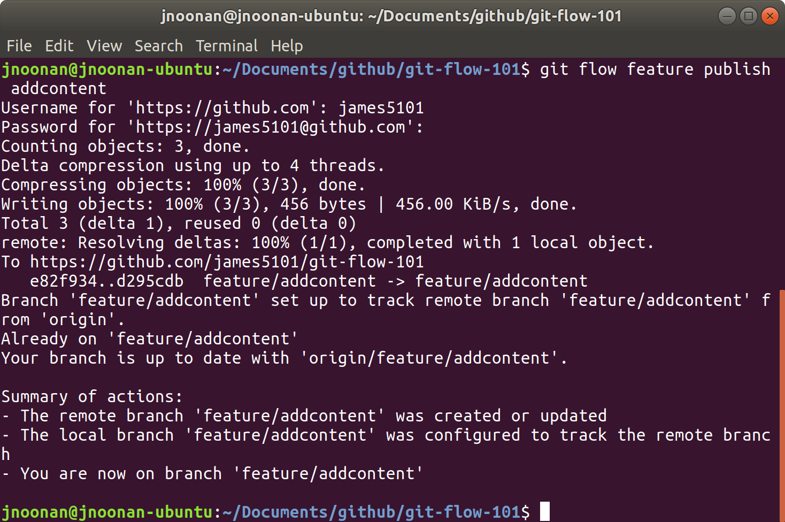
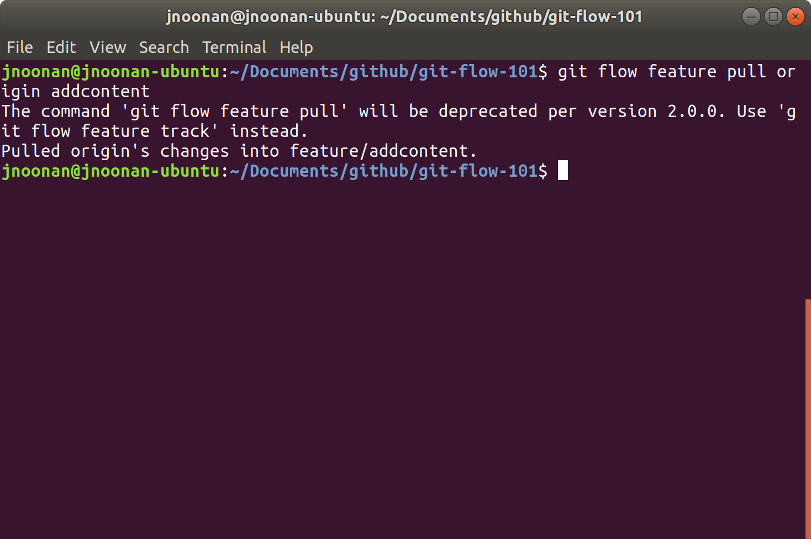
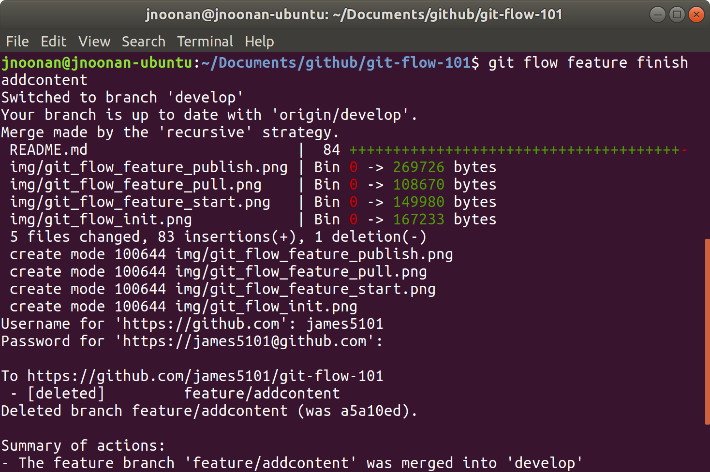

# Git Flow Command Line Tool 101

## Overview
The Git Flow Command Line tool helps you manage your Git Flow process with stream lined commands. The commands are a wrapper around the traditonal git commands. In this document we will go over some of the commands that run behind the scenes when you are using the git flow command line tools.

*Disclaimer - the git flow command line tool is not a replacement for git, it is just a wrapper around git commands. This is an optional tool to use. Its mainpurpose is to help you with the git flow workflow and to not have to memorize a bunch of git commands in order to achieve that workflow. Also, I have not seen a way to use this with any git GUI tools.*


## Git Flow Workflow Overview
Gitflow Workflow is a Git workflow design that was first published and made popular by Vincent Driessen at nvie. The Gitflow Workflow defines a strict branching model designed around the project release.  

Gitflow is ideally suited for projects that have a scheduled release cycle. It assigns very specific roles to different branches and defines how and when they should interact. In addition to feature branches, it uses individual branches for preparing, maintaining, and recording releases.Y ou get to leverage pull requests, isolated experiments, and more efficient collaboration.

Full overview [HERE](https://www.atlassian.com/git/tutorials/comparing-workflows/gitflow-workflow)

## Common git flow commands mapped to git commands
### **Features**
### Initilaze
* When initizaling a project with the git flow commands the first command we need to run is :
```
git flow init
```
Git equivalent commands
```
git init
git commit --allow-empty -m "Initial commit"
git checkout -b develop master
```
#### What it looks like


### Features
* When we pick up a story and want to start a feature we will need to enter this command :
```
git flow feature start MYNEWFEATURE
```
Git equivalent commands
```
git checkout -b feature/MYFNEWEATURE develop
```
#### What it looks like


### Push a feature branch
* In order to share our feature branch we need to push it to the remote. This next command helps us push our changes (*Side note you still have to commit changes before pushing*)
```
git flow feature publish MYNEWFEATURE 	
```
Git equivalent commands
```
git checkout feature/MYNEWFEATURE
git push origin feature/MYNEWFEATURE
```
#### What it looks like


## Get latest feature branch
* In order to pull down changes from the remote we will need to run:
```
git flow feature pull origin MYNEWFEATURE
```
Git equivalent commands
```
git checkout feature/MYFEATURE
git pull --rebase origin feature/MYNEWFEATURE
```

#### What it looks like
(*Looks like this will be depricated soon*)


### Finish feature
* Ok, so you coded your feature, wrote your tests and  we are at the last step. Lets finsih this feature up:
```
git flow feature finish MYNEWFEATURE
```
Git equivalent commands
```
git checkout develop
git merge --no-ff feature/MYNEWFEATURE
git branch -d feature/MYNEWFEATURE
```
### What it looks like


### **Releases**
### Create release
* We have all our changes in our develop branch, our next step is to cut our release branch. The command needed to do this is:
```
git flow release start 1.4.0
```
Git equivalent commands
```
git checkout -b release/1.4.0 develop
```
### What it looks like


### Push release
* Next we want to push our release branch up to the remote. The command needed to do this is:
```
git flow release publish 1.4.0
```
Git equivalent commands
```
git checkout release/1.4.0
git push origin release/1.4.0
```
### What it looks like


### Finalize release
* Next we want to finalize our release branch. The command needed to do this is:
```
git flow release finish 1.4.0
```
Git equivalent commands
```
git checkout master
git merge --no-ff release/1.4.0
git tag -a 1.4.0
git checkout develop
git merge --no-ff release/1.4.0
git branch -d release/1.4.0
```
### What it looks like


